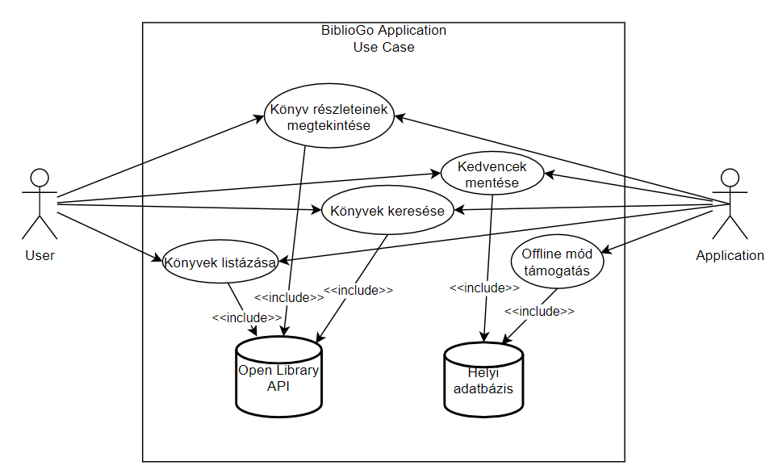
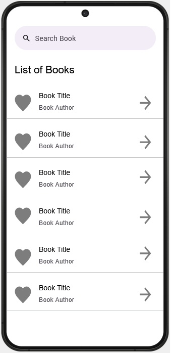
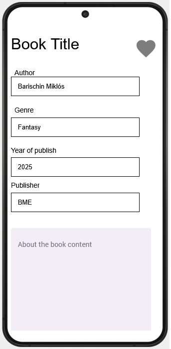
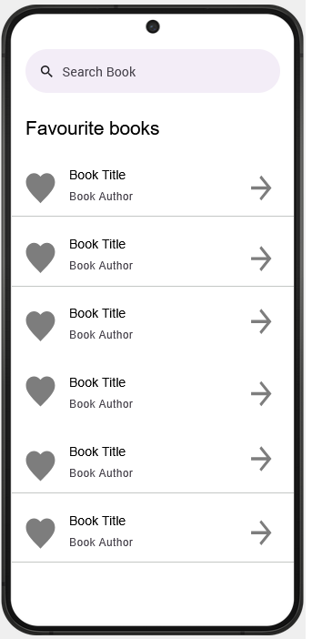
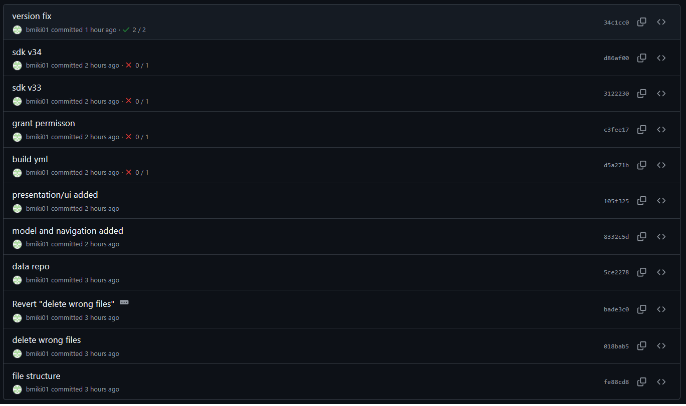
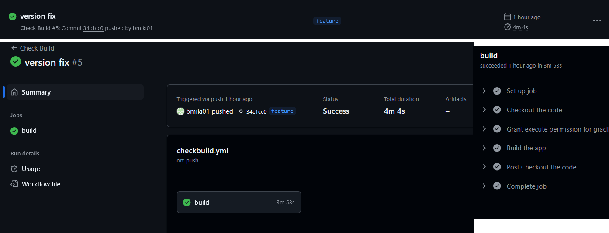
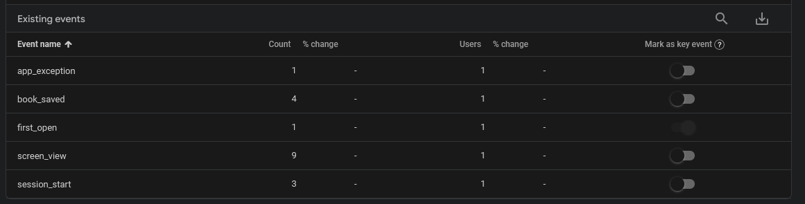
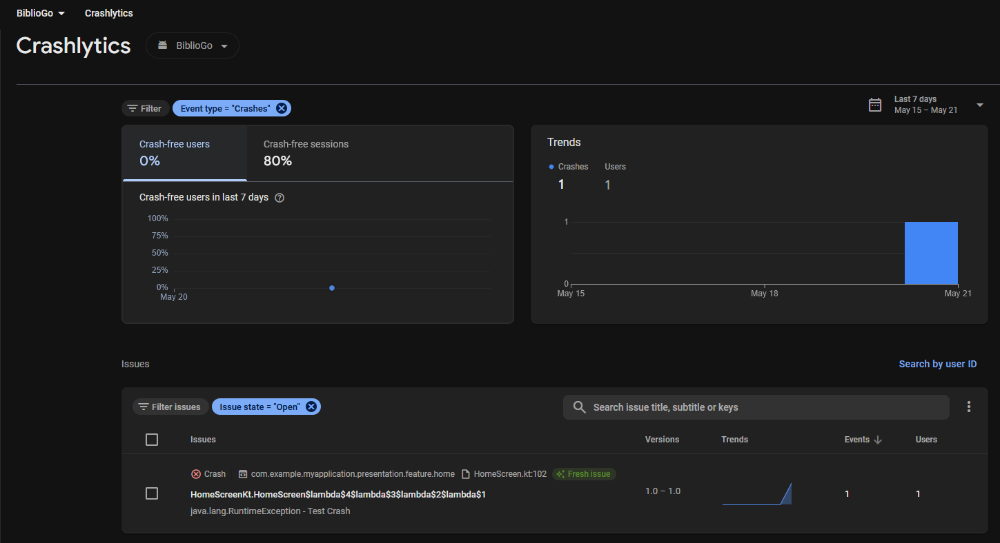
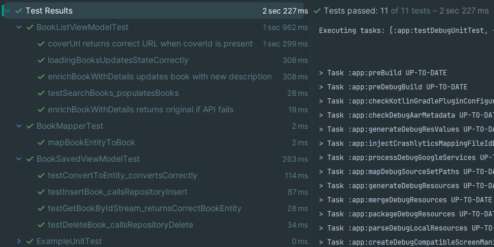

# Házi feladat specifikáció

Információk [itt](https://viaumb02.github.io/laborok/android/A01/)

## Mobilszoftver Laboratórium
### [Dátum - 2025 tavaszi félév]
### [Barischin Miklós] - ([DPTGCJ])
### Laborvezető: [Hideg Attila]

## [BiblioGo]

## Bemutatás

A BiblioGo egy mobilalkalmazás, amely lehetővé teszi a felhasználók számára, hogy böngésszenek és keressenek könyveket nyilvánosan elérhető könyvtári adatbázisokban. Az ötlet onnan származik, hogy sok könyvtár rendelkezik nyílt API-val, amelyeken keresztül elérhetőek a könyvkatalógusok. Az alkalmazás célközönsége könyvmolyok, diákok és kutatók, akik gyorsan és kényelmesen szeretnék megtalálni a számukra érdekes könyveket.
Az érdekes és/vagy hasznos könyveket offline módban is lehessen olvasni.

## Főbb funkciók

- **Könyvek listázása**: A felhasználó böngészhet a nyilvános könyvtári katalógusokban (pl. Open Library API használatával).
- **Keresési funkció**: Kulcsszavak alapján lehetőség van könyvek keresésére.
- **Könyv részletes adatainak megjelenítése**: A kiválasztott könyv részletei (cím, szerző, kiadási év, borító, rövid leírás stb.) megtekinthetők.
- **Kedvencek mentése**: A felhasználó elmentheti a kedvenc könyveit offline elérésre.
- **Offline működés támogatása**: Az utoljára keresett és megtekintett könyvek elérhetők maradnak internetkapcsolat nélkül is.
- **About képernyő**: Az alkalmazásról és a fejlesztőről szóló információk megtekinthetők.

## Actorok, User Story-k és Use-Case-ek

### Actorok:

- **Felhasználó**: Böngészi és keres könyveket, elmenti kedvenceit.
- **Rendszer**: Kommunikál a könyvtári API-val és biztosítja az offline működést.

### User Story-k:

- **Felhasználóként szeretném átböngészni a nyilvános könyvtári katalógust, hogy új könyveket fedezzek fel.**
- **Felhasználóként szeretnék egy kereső funkciót, hogy gyorsan megtaláljam az engem érdeklő könyveket.**
- **Felhasználóként szeretném megtekinteni egy könyv részletes adatait, hogy eldönthessem, érdekel-e engem.**
- **Felhasználóként szeretném a kedvenc könyveimet elmenteni, hogy később is könnyen elérjem őket.**
- **Felhasználóként szeretném, hogy a legutóbbi kereséseim és megtekintett könyveim elérhetők maradjanak offline is.**

### Use-Case Diagram

## Képernyőtervek

A képernyő tervek még módosulhatnak egy két elemben, ez az elképzelés egyelőre. Módosítás alatt értem például a kedvencek icon lecserélését mondjuk egy gombra és azzal menteni a részletes adatok oldalon. A könyv részletei több adat vagy más elrendezés. 

#Kezdő képernyő

#Könyvek listázása

#Könyv részletes adatai

#Kedvenc/mentett könyvek

#About

##Architektúra

A választott architectúra a Model View ViewModel (MVVM). Az MVVM egy elterjedt architektúra melyet sokan használnak. A minta jól elkülöníti az üzleti logikát (Model), a megjelenítést (View), és a felhasználói interakciókat kezelő köztes réteget (ViewModel). Ez elősegíti a kód olvashatóságát, újrafelhasználhatóságát és könnyíti a tesztelést.
A Jetpack Compose tökéletesen együttműködik a ViewModel réteggel, így a reaktív UI-kezelés is egyszerűbbé válik.

##Commitok

##Build

## Hálózat és ORM

| Osztály | Felelősség |
|:---|:---|
| BookApiService.kt | Retrofit API interfész a hálózati hívásokhoz |
| BookDto.kt | Az Open Library API válaszmodellje |
| BookRepository.kt | Repository interfész |
| BookRepositoryImpl.kt | Repository implementáció: API + adatbázis |
| Book.kt | Alkalmazás szintű modell |
| BookEntity.kt | Room Entity az adatbázisba mentéshez |
| BookDao.kt | Room DAO - adatbázis műveletek |
| AppDatabase.kt | Room adatbázis inicializáció |
| NetworkModule.kt | Retrofit és API service DI |
| DatabaseModule.kt | Room adatbázis és DAO DI |
| BookSearchViewModel.kt | ViewModel a keresés kezeléséhez |

## Video linkje - megjegyzés a minőséget vedd fel
<https://drive.google.com/file/d/1_IODug08-IwVIpYr2wTdv0XQOGeMmEcu/view?usp=sharing>

## FireBase Analytics
A BookListScreen-ben az onToggleFavorite eseményhez (könyv mentés/törlés) adtam hozzá a FireBase egyedi eseményt (book_saved).

## FireBase Crashlytics
Létrehoztam egy új gombot a kezdő képernyőre és ha rányom a felhasználó RuntimeException-t dob és összeomlik az alkalmazás.

# Teszt Dokumentáció
A projektben egységteszteket írtam a könyvtárak és ViewModel logika helyes működésének ellenőrzésére.

### 1. BookEntity ↔ Book konverzió

**Cél**: Ellenőrizni, hogy a `BookEntity.toBook()` és `Book.toEntity()` metódusok helyesen alakítják-e át az adatokat.

**Stratégia**:
- Létrehoztam egy példakönyvet és -entitást.
- Meghívtam a `.toBook()` és `.toEntity()` függvényeket.
- Assert-el ellenőriztem az összes mező megegyezését.

**Eredmény**: Minden mező sikeresen átkonvertálódott, beleértve listák és null értékek kezelését is.

---

### 2. `BookListViewModel` – Keresés és betöltés

**Cél**: Hogy biztosítsuk, a keresési funkció helyesen hívja a repository-t, és frissíti az állapotot.

**Stratégia**:
- A `searchBooks("android")` lekérdezés mockolása
- `setSearchQuery(...)` meghívása
- Várt eredmény: `books.value == listOf(mockBook)`

**Eredmény**: Sikeresen betölti a könyveket a keresési lekérdezés alapján.

---

### 3. `enrichBookWithDetails(book)` – Bővített adatok betöltése

**Cél**: A részletes könyvadatok betöltésének ellenőrzése API-hívás után, illetve hiba esetén való visszatérés az eredeti könyvre.

**Stratégia**:

#### a) Sikeres bővítés:
- Simulált részletes könyv válasz: `copy(description = "New enriched description")`
- Ellenőrizve, hogy a callback megkapta-e a bővített könyvet

#### b) Hibás API-válasz:
- Dobott kivétel: `throw Exception("API Error")`
- Ellenőrizve, hogy az eredeti könyv továbbra is visszaadásra kerül

**Eredmény**:
- Ha sikerült az API-kapcsolat → gazdagított könyv jelenik meg
- Ha nem sikerült → az eredeti könyv kerül visszaadásra

---

### 4. `coverUrl` generálás a `coverId` alapján

**Cél**: Ellenőrizni, hogy a `coverUrl` helyesen generálódik-e a `coverId` alapján.

**Stratégia**:
- Adott `coverId = 123456` → várt URL: `"https://covers.openlibrary.org/b/id/123456.jpg "`
- Null `coverId` esetén `coverUrl == null`

**Eredmény**: Az URL generálás helyesen működik, és null-biztonságos.

---

### 5. `BookSavedViewModel` – Könyv mentése és törlése

**Cél**: Ellenőrizni, hogy a mentési és törlési műveletek meghívják-e a repository-t.

**Stratégia**:
- `coEvery { repository.insertBook(...) } just Runs`
- `coVerify(exactly = 1) { repository.insertBook(...) }`

**Eredmény**: Minden művelet sikeresen meghívja a repository megfelelő metódusait.
